# 🧠 Ecom — Exhaustive Knowledge Graph

> **Project**: LuxeMarket — Multi-Vendor Marketplace
> **Framework**: Flutter + Firebase | **Architecture**: Clean Architecture + DDD
> **State**: Riverpod (codegen) | **Errors**: fpdart `Either` | **Navigation**: GoRouter
> **Generated**: 2026-07-01

---

## 📐 High-Level Architecture

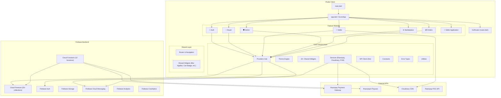

---

## 🔗 Cross-Feature Dependency Graph

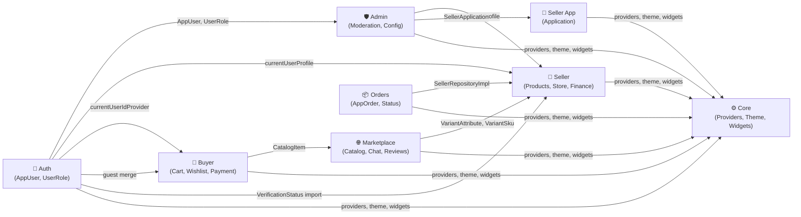

---

## 📦 Entry Points

### `main.dart`

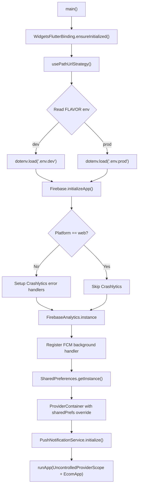

| Function | Return | Description |
|----------|--------|-------------|
| `main()` | `Future<void>` | App bootstrap — env loading, Firebase init, Crashlytics, FCM, SharedPrefs, Riverpod container |

### `app.dart` — `EcomApp` (ConsumerWidget)

| Method | Description |
|--------|-------------|
| `build(context, ref)` | Returns `MaterialApp.router` with GoRouter, light/dark theme, localization, offline overlay |

| Provider Watched | Purpose |
|-----------------|---------|
| `routerProvider` | GoRouter instance |
| `themeProvider` | Current ThemeMode |
| `isConnectedProvider` | Network connectivity |

---

## ⚙️ Core Infrastructure — Complete Breakdown

### 📁 `core/constants/`

#### `AppConstants`
| Field | Type | Value |
|-------|------|-------|
| `appName` | `static const String` | `'LuxeMarket'` |
| `maxImageSizeMB` | `static const int` | `5` |
| `imageQuality` | `static const int` | `80` |
| `maxImageWidth` | `static const int` | `800` |
| `uploadTimeout` | `static const Duration` | `60s` |
| `firestoreTimeout` | `static const Duration` | `15s` |

#### `AppInfo` (abstract)
| Field | Type | Value |
|-------|------|-------|
| `appName` | `static const String` | `'ecom'` |
| `version` | `static const String` | `'1.0.0'` |
| `supportEmail` | `static const String` | `'support@ecom.app'` |
| `supportPhone` | `static const String` | `'+91 98765 43210'` |
| `privacyPolicyUrl` | `static const String` | `'https://ecom.app/privacy'` |
| `termsUrl` | `static const String` | `'https://ecom.app/terms'` |

#### `AppRadius` (abstract final)
| Field | Type | Value |
|-------|------|-------|
| `xs` | `Radius` | `circular(6)` |
| `sm` | `Radius` | `circular(10)` |
| `md` | `Radius` | `circular(14)` |
| `lg` | `Radius` | `circular(18)` |
| `xl` | `Radius` | `circular(24)` |
| `borderXS` … `borderXL` | `BorderRadius` | `BorderRadius.all(...)` variants |

#### `AppSpacing` (abstract final, constants version)
| Field | Value | Notes |
|-------|-------|-------|
| `xs` | `4` | Tiny gap |
| `sm` | `8` | Small gap |
| `md` | `16` | Medium gap |
| `lg` | `24` | Large gap |
| `xl` | `32` | Extra large |
| `xxl` | `48` | Double extra large |
| `pagePadding` | `EdgeInsets.all(md)` | |
| `screenPadding` | `horizontal: lg, vertical: md` | |
| `cardPadding` | `EdgeInsets.all(md)` | |
| `listItemPadding` | `horizontal: md, vertical: sm` | |

---

### 📁 `core/errors/`

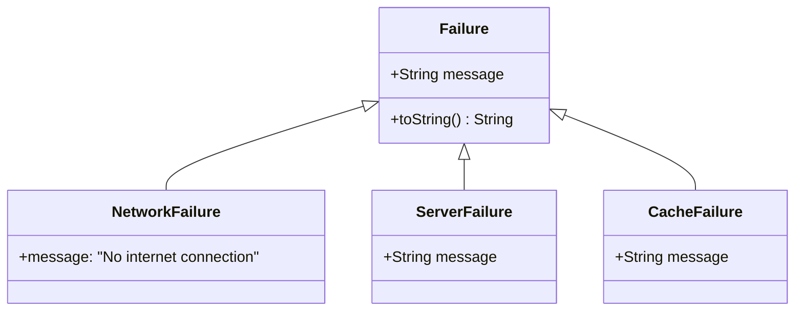

---

### 📁 `core/network/`

#### `apiClientProvider` — `Provider<Dio>`
| Config | Value |
|--------|-------|
| `connectTimeout` | `15s` |
| `receiveTimeout` | `15s` |
| `Content-Type` | `application/json` |
| `Accept` | `application/json` |
| Interceptors | Empty auth stub + `LogInterceptor` (debug) |

---

### 📁 `core/providers/` — The Central Provider Hub

#### `common_providers.dart` (303 lines)

**Cloud Function URLs:**
| Constant | URL |
|----------|-----|
| `getRazorpayKeyUrl` | `https://getrazorpaykey-oshbhnscba-uc.a.run.app` |
| `createRazorpayOrderUrl` | `https://createrazorpayorder-oshbhnscba-uc.a.run.app` |
| `verifyAndFinalizePaymentUrl` | `https://verifyandfinalizepayment-oshbhnscba-uc.a.run.app` |

**Providers:**

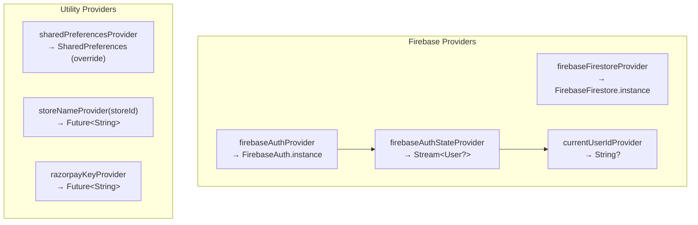

| Provider | Riverpod Type | Returns | Details |
|----------|--------------|---------|---------|
| `firebaseFirestoreProvider` | `@riverpod` | `FirebaseFirestore` | `.instance` |
| `sharedPreferencesProvider` | `@riverpod` | `SharedPreferences` | Must be overridden (throws) |
| `firebaseAuthProvider` | `@riverpod` | `FirebaseAuth` | `.instance` |
| `firebaseAuthStateProvider` | `@riverpod Stream` | `Stream<User?>` | `authStateChanges()` |
| `currentUserIdProvider` | `@riverpod` | `String?` | Derived from auth state `.uid` |
| `storeNameProvider` | `FutureProvider.family` | `Future<String>` | Fetches from `stores/{id}` |
| `razorpayKeyProvider` | `FutureProvider` | `Future<String>` | GET to Cloud Function |

**Top-level Functions:**

| Function | Parameters | Returns | Description |
|----------|-----------|---------|-------------|
| `_safeAppCheckToken()` | — | `Future<String?>` | Always returns `null` (App Check disabled) |
| `createRazorpayOrder()` | `amountInPaise`, `idToken`, `currency`, `receipt` | `Future<Map<String, dynamic>>` | POST to Cloud Function → `{id, amount, currency}` |
| `verifyAndFinalizePayment()` | `razorpayPaymentId`, `razorpayOrderId`, `razorpaySignature`, `buyerId`, `buyerName`, `deliveryAddress`, `orders`, `idToken`, `couponCode` | `Future<Map<String, dynamic>>` | POST to Cloud Function → `{success, orderIds}` |

#### `categories_provider.dart`

| Provider | Type | Returns |
|----------|------|---------|
| `activeCategoriesStreamProvider` | `@riverpod Stream` | `Stream<List<String>>` |

Default categories: `Electronics`, `Fashion`, `Home`, `Beauty`, `Sports`, `Groceries`, `Books`, `Toys`, `Fitness`, `Gifts`

#### `connectivity_provider.dart`

| Provider | Type | Returns | Details |
|----------|------|---------|---------|
| `isConnectedProvider` | `@riverpod Stream` | `Stream<bool>` | Uses `connectivity_plus` |

| Helper | Returns | Description |
|--------|---------|-------------|
| `_hasConnection(List<ConnectivityResult>)` | `bool` | Checks for non-none connectivity |

#### `theme_provider.dart`

| Class | Extends | State |
|-------|---------|-------|
| `ThemeNotifier` | `_$ThemeNotifier` | `ThemeMode` |

| Method | Returns | Description |
|--------|---------|-------------|
| `build()` | `ThemeMode` | Default `system`, loads from SharedPrefs |
| `setThemeMode(ThemeMode)` | `void` | Persists to SharedPrefs key `'app_theme_mode'` |
| `_loadFromPrefs()` | `void` | Private — reads stored theme |
| `_fromString(String)` | `ThemeMode` | Private — parses string to enum |
| `_toString(ThemeMode)` | `String` | Private — serializes enum |

---

### 📁 `core/services/` — Complete Service Map

#### `CloudinaryService`

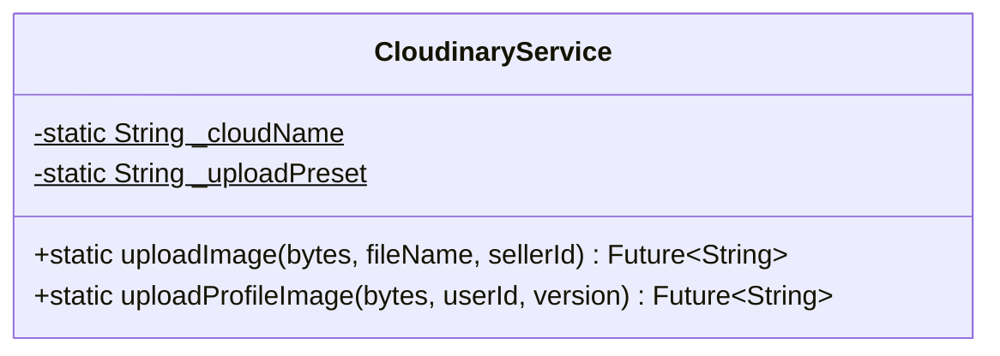

| Method | Parameters | Returns | Description |
|--------|-----------|---------|-------------|
| `uploadImage()` | `Uint8List bytes`, `String fileName`, `String sellerId` | `Future<String>` | Uploads to `luxemarket_products` preset, folder `luxemarket` → `secure_url` |
| `uploadProfileImage()` | `Uint8List bytes`, `String userId`, `int version` | `Future<String>` | Uploads to `user_profiles/{userId}_v{version}` → `secure_url` |

#### `PushNotificationService`

| Provider | Type |
|----------|------|
| `pushNotificationServiceProvider` | `Provider<PushNotificationService>` |

| Top-level Function | Description |
|-------------------|-------------|
| `firebaseMessagingBackgroundHandler(RemoteMessage)` | `@pragma('vm:entry-point')` — logs background message |

| Field | Type | Description |
|-------|------|-------------|
| `_fcm` | `FirebaseMessaging` | FCM instance |
| `_ref` | `Ref` | Riverpod ref |
| `_queuedToken` | `String?` | Queued FCM token before user login |

| Method | Returns | Description |
|--------|---------|-------------|
| `initialize()` | `Future<void>` | Requests permissions (mobile), gets FCM token, sets up listeners |
| `_handleNewToken(token)` | `void` | Saves to backend if logged in, else queues |
| `_saveTokenToBackend(userId, token)` | `Future<void>` | Calls `authRepository.updateFCMToken()` |
| `_setupDeepLinking()` | `void` | Handles `getInitialMessage()` + `onMessageOpenedApp` |
| `_handleNotificationRoute(message)` | `void` | Reads `data['route']`, pushes via `rootNavigatorKey` |

#### Razorpay Service (Platform-Adaptive)

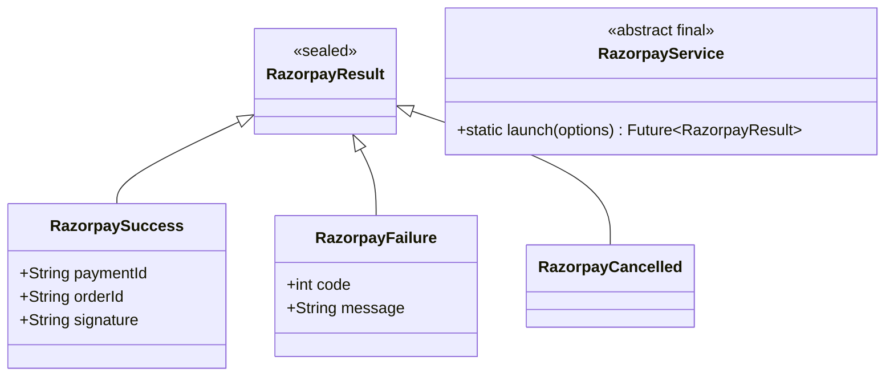

| File | Platform | Function | Description |
|------|----------|----------|-------------|
| `razorpay_service.dart` | All | `RazorpayService.launch(options)` | Delegates via conditional import |
| `razorpay_mobile_launcher.dart` | Mobile | `launchRazorpay(options)` | Uses `razorpay_flutter` SDK with Completer |
| `razorpay_web_launcher.dart` | Web | `launchRazorpay(options)` | JS interop with `_JsRazorpay`, `jsify()` |
| `razorpay_launcher_stub.dart` | Fallback | `launchRazorpay(options)` | Throws `UnsupportedError` |

---

### 📁 `core/theme/`

#### `AppColors` (abstract final, 30+ color constants)

| Category | Field | Hex Value |
|----------|-------|-----------|
| **Primary** | `primary` | `0xFF7C3AED` |
| | `primaryDark` | `0xFFA855F7` |
| | `secondary` | `0xFF0EA5E9` |
| | `error` | `0xFFEF4444` |
| **Light BG** | `lightBgPrimary` | `0xFFF4F3FF` |
| | `lightBgSurface` | `0xFFFFFFFF` |
| **Light Text** | `lightTextPrimary` | `0xFF1A1A2E` |
| | `lightTextSecond` | `0xFF6B7280` |
| **Dark BG** | `darkBgPrimary` | `0xFF0D0D1A` |
| | `darkBgSurface` | `0xFF1A1A2E` |
| **Dark Text** | `darkTextPrimary` | `0xFFF5F3FF` |
| | `darkTextSecond` | `0xFFA1A1AA` |
| **Feedback** | `success` | `0xFF10B981` |
| | `warning` | `0xFFF59E0B` |
| | `info` | `0xFF3B82F6` |
| **Border** | `borderLight` | `0xFFE2E8F0` |
| | `borderDark` | `0xFF2D3748` |
| **Gradients** | `premiumGradient` | blue → indigo |
| | `premiumDarkGradient` | dark → darker |

#### `AppShadows` (abstract final)

| Shadow | Opacity | Blur |
|--------|---------|------|
| `lightSm` | 5% black | 2 |
| `lightMd` | 8% black | 12 |
| `lightLg` | 10% black | 24 |
| `lightXl` | 15% black | 48 |
| `darkSm` | 50% black | — |
| `darkMd` | 60% black | — |
| `darkLg` | 70% black | — |
| `primaryGlow` | 25% primary | 16 |

#### `AppTypography` (abstract final)

| Style | Size | Weight |
|-------|------|--------|
| `displayLarge` | 57 | bold |
| `displayMedium` | 45 | — |
| `displaySmall` | 36 | — |
| `headlineLarge` | 32 | w700 |
| `headlineMedium` | 28 | — |
| `headlineSmall` | 24 | w600 |
| `titleLarge` | 22 | — |
| `titleMedium` | 16 | w600 |
| `titleSmall` | 14 | w600 |
| `bodyLarge` | 16 | w400 |
| `bodyMedium` | 14 | — |
| `bodySmall` | 12 | — |
| `labelLarge` | 14 | w600 |
| `labelMedium` | 12 | — |
| `labelSmall` | 11 | w500 |

**Font Family**: `Inter`

#### `AppTheme` (final class)

| Property | Description |
|----------|-------------|
| `lightTheme` | Material3, light scheme, primary seed, centered AppBar, rounded Cards (24px), ElevatedButton black bg |
| `darkTheme` | Material3, dark scheme, ElevatedButton white bg/black fg |

---

### 📁 `core/utils/`

#### `ImageUtils`

| Method | Parameters | Returns | Description |
|--------|-----------|---------|-------------|
| `compressImage()` | `Uint8List bytes` | `Future<Uint8List>` | Skips on web; quality=80, maxWidth=800 |
| `isValidImageType()` | `String fileName` | `bool` | Checks `.jpg,.jpeg,.png,.webp,.gif,.bmp` |
| `isWithinSizeLimit()` | `Uint8List bytes, int maxMB` | `bool` | Byte length check |

#### `PriceHelper`

| Method | Parameters | Returns | Description |
|--------|-----------|---------|-------------|
| `getEffectivePrice()` | `CatalogItem item` | `double` | Applies flash sale discount if active |
| `getDiscountPercent()` | `CatalogItem item` | `double` | Flash sale discount % |
| `isFlashSaleActive()` | `CatalogItem item` | `bool` | Checks `isFlashDeal`, `flashSaleStatus`, validates timestamps |

#### `time_utils.dart`

| Function | Returns | Description |
|----------|---------|-------------|
| `getGreetingMessage()` | `String` | `'Good morning/afternoon/evening/night'` based on hour |

---

### 📁 `core/widgets/` — 22 Shared Widgets + 4 Premium Widgets

| Widget | File | Description |
|--------|------|-------------|
| `AppAsyncValueBuilder` | `app_async_value_builder.dart` | Generic async state handler (loading/error/data) |
| `AppAvatar` | `app_avatar.dart` | User avatar with fallback |
| `AppBadge` | `app_badge.dart` | Badge/tag component |
| `AppBottomNavBar` | `app_bottom_nav_bar.dart` | Bottom navigation bar |
| `AppCard` | `app_card.dart` | Styled card container |
| `AppEmptyView` | `app_empty_view.dart` | Empty state with icon + message |
| `AppErrorView` | `app_error_view.dart` | Error state with retry |
| `AppLoadingView` | `app_loading_view.dart` | Loading spinner |
| `AppNetworkImage` | `app_network_image.dart` | Cached network image with placeholder |
| `AppOrderCard` | `app_order_card.dart` | Order summary card |
| `AppPriceText` | `app_price_text.dart` | Formatted price with currency |
| `AppPrimaryButton` | `app_primary_button.dart` | Primary action button |
| `AppProductCard` | `app_product_card.dart` | Product display card **(10KB, largest widget)** |
| `AppRatingBar` | `app_rating_bar.dart` | Star rating display |
| `AppScaffold` | `app_scaffold.dart` | Base scaffold wrapper |
| `AppSearchBar` | `app_search_bar.dart` | Search input bar |
| `AppSectionTitle` | `app_section_title.dart` | Section header text |
| `AppShimmer` | `app_shimmer.dart` | Loading shimmer effect |
| `AppStatCard` | `app_stat_card.dart` | Statistics display card |
| `AppStoreCard` | `app_store_card.dart` | Store info card |
| `AppTextField` | `app_text_field.dart` | Styled text input |
| `ResponsiveLayout` | `responsive_layout.dart` | Responsive breakpoint layout |
| `GradientActionButton` | `buttons/gradient_action_button.dart` | Gradient-styled button |
| `GlassCard` | `cards/glass_card.dart` | Glassmorphism card |
| `PremiumFormField` | `inputs/premium_form_field.dart` | Premium styled form input |
| `Premium25DScaffold` | `scaffolds/premium_25d_scaffold.dart` | 2.5D perspective scaffold |

---

### 📁 `lib/services/`

#### `IfscService` + Models

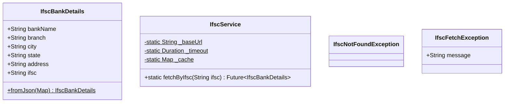

---

## 🧩 Shared Module (`lib/shared/`)

### Navigation — `router.dart` (38,961 bytes)

| Export | Type | Description |
|--------|------|-------------|
| `routerProvider` | `Provider<GoRouter>` | Full app router with all routes |
| `rootNavigatorKey` | `GlobalKey<NavigatorState>` | Used by deep linking / push notifications |

### Shared Widgets (6)

| Widget | Type | Providers Watched | Description |
|--------|------|-------------------|-------------|
| `BlurAppBar` | `StatelessWidget` | — | Sliver app bar with `BackdropFilter` blur |
| `BlurAppBarRegular` | `StatelessWidget` + `PreferredSizeWidget` | — | Regular non-sliver blurred app bar |
| `CartIconWithBadge` | `ConsumerWidget` | `cartControllerProvider` | Cart icon with pink badge count → `/buyer/cart` |
| `NotificationBell` | `ConsumerWidget` | `userNotificationsProvider` | Bell with unread count, smart path routing |
| `WishlistIconWithBadge` | `ConsumerWidget` | `wishlistStreamProvider` | Heart icon (filled when > 0), purple badge → `/buyer/wishlist` |
| `OfflineOverlay` | `StatelessWidget` | — | Full-screen WiFi-off overlay |
| `MaintenanceScreen` | `ConsumerWidget` | `authController` | Maintenance page with admin bypass |

---

## 🔐 Feature: Auth

### Entity Diagram

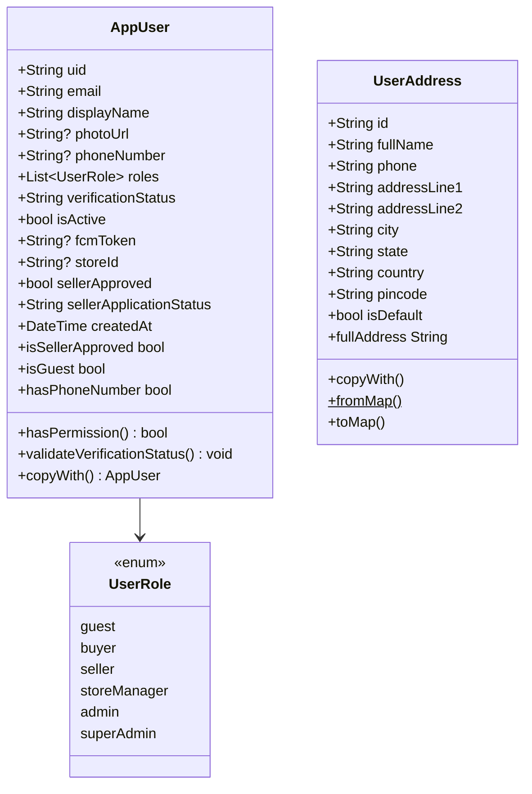

### Repository Interfaces

#### `AuthRepository` (abstract interface)

| Method | Returns | Description |
|--------|---------|-------------|
| `authStateChanges` | `Stream<Option<AppUser>>` | Auth state stream using fpdart Option |
| `signInWithEmailAndPassword(email, password)` | `Future<Either<String, AppUser>>` | Sign in |
| `signUpWithEmailAndPassword(email, password, displayName)` | `Future<Either<String, AppUser>>` | Sign up |
| `getCurrentUserSession()` | `Future<Option<AppUser>>` | Current session |
| `signOut()` | `Future<Either<String, Unit>>` | Sign out |
| `updateUserProfile(uid, data)` | `Future<Either<String, Unit>>` | Update profile fields |
| `updateFCMToken(userId, token)` | `Future<void>` | Save FCM token |
| `sendPasswordResetEmail(email)` | `Future<Either<String, Unit>>` | Password reset |

#### `AddressRepository` (abstract)

| Method | Returns | Description |
|--------|---------|-------------|
| `watchAddresses(userId)` | `Stream<List<UserAddress>>` | Real-time address stream |
| `addAddress(userId, address)` | `Future<Either<String, Unit>>` | Add new address |
| `updateAddress(userId, address)` | `Future<Either<String, Unit>>` | Update address |
| `deleteAddress(userId, addressId)` | `Future<Either<String, Unit>>` | Delete address |
| `setDefaultAddress(userId, addressId)` | `Future<Either<String, Unit>>` | Set as default |

### Data Layer

| Class | Purpose |
|-------|---------|
| `UserDto` | DTO with `.g.dart` codegen |
| `AuthRepositoryImpl` | Firestore + FirebaseAuth implementation |
| `AddressRepositoryImpl` | Firestore subcollection implementation |

### Providers & Controllers

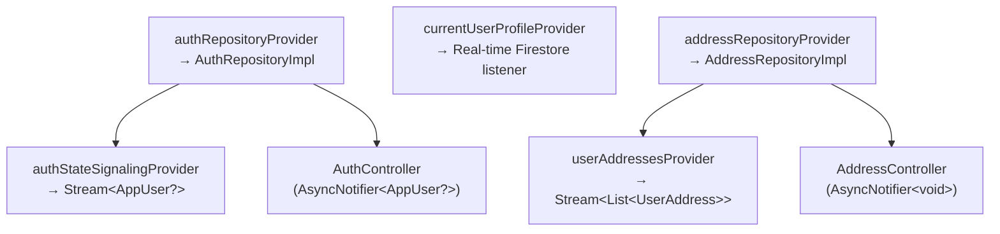

#### `AuthController` (AsyncNotifier\<AppUser?\>)

| Method | Returns | Description |
|--------|---------|-------------|
| `loginWithCredentials(email, password)` | `Future<void>` | Sign in + merge guest cart/wishlist |
| `registerWithCredentials(email, password, displayName)` | `Future<void>` | Sign up + merge guest cart/wishlist |
| `executeLogoutSequence()` | `Future<void>` | Sign out |
| `updateProfile(displayName, phoneNumber)` | `Future<void>` | Update profile |
| `sendPasswordReset(email)` | `Future<void>` | Password reset |
| `_mergeGuestCart()` | Private | Merges GuestCartController → CartController |
| `_mergeGuestWishlist()` | Private | Merges GuestWishlistController → WishlistController |

#### `AddressController` (AsyncNotifier\<void\>)

| Method | Returns | Description |
|--------|---------|-------------|
| `addAddress(address)` | `Future<void>` | Add |
| `updateAddress(address)` | `Future<void>` | Update |
| `deleteAddress(addressId)` | `Future<void>` | Delete |
| `setDefault(addressId)` | `Future<void>` | Set default |

### Screens & Widgets

| Screen | Description |
|--------|-------------|
| `LandingScreen` | Welcome/onboarding page |
| `LoginScreen` | Email/password login |
| `SignupScreen` | Registration form |
| `AddressScreen` | Manage delivery addresses |

| Widget | Description |
|--------|-------------|
| `Auth25dLayout` | 2.5D perspective auth layout |
| `Auth3dCard` | 3D card effect for auth |
| `Auth3dWidgets` | 3D widget components |
| `AuthLayout` | Standard auth layout wrapper |
| `LiquidMeshBackground` | Animated liquid mesh background |
| `PremiumTextField` | Premium styled text input |

---

## 🛒 Feature: Buyer

### Entity Diagram

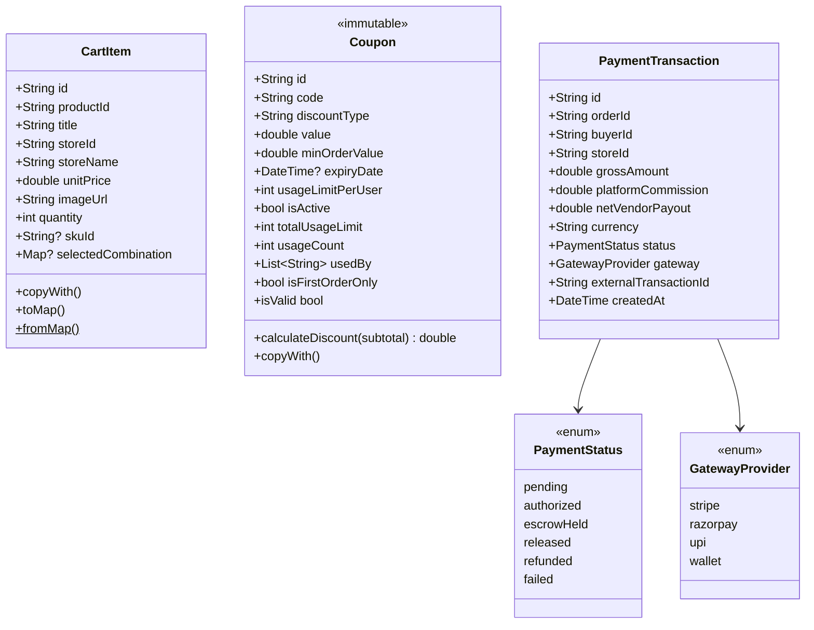

### Repository Interfaces (5)

#### `CartRepository`
| Method | Returns | Description |
|--------|---------|-------------|
| `watchCart(userId)` | `Stream<List<CartItem>>` | Real-time cart stream |
| `addCartItem(userId, item)` | `Future<Either>` | Add item |
| `updateCartItemQuantity(userId, itemId, qty)` | `Future<Either>` | Update quantity |
| `removeCartItem(userId, itemId)` | `Future<Either>` | Remove item |
| `clearCart(userId)` | `Future<Either>` | Clear all |

#### `WishlistRepository`
| Method | Returns | Description |
|--------|---------|-------------|
| `watchWishlist(userId)` | `Stream<List<CatalogItem>>` | Streams wishlist (uses marketplace CatalogItem) |
| `addToWishlist(userId, productId)` | `Future<Either>` | Add to wishlist |
| `removeFromWishlist(userId, productId)` | `Future<Either>` | Remove |
| `isInWishlist(userId, productId)` | `Future<bool>` | Check existence |

#### `PaymentRepository`
| Method | Returns | Description |
|--------|---------|-------------|
| `fetchRazorpayKey()` | `Future<String>` | Get Razorpay public key |
| `createOrder(amount, currency, receipt)` | `Future<Map>` | Create Razorpay order |
| `verifyAndFinalize(...)` | `Future<Map>` | Verify payment + create orders |
| `recordPaymentFailure(data)` | `Future<void>` | Save failure record |
| `getTransactionByPaymentId(paymentId)` | `Future<PaymentTransaction?>` | Lookup by payment ID |

#### `CouponRepository`
| Method | Returns | Description |
|--------|---------|-------------|
| `validateCoupon(code, userId, subtotal)` | `Future<Either<String, Coupon>>` | Validate coupon |
| `redeemCoupon(code, userId)` | `Future<Either>` | Redeem coupon |

#### `ProfileRepository`
| Method | Returns | Description |
|--------|---------|-------------|
| `uploadProfileImage(userId, bytes)` | `Future<Either<String, String>>` | Upload → returns URL |

### Providers & Controllers

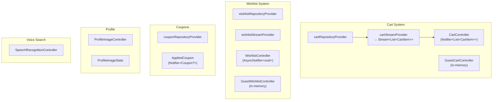

#### `CartController` (Notifier\<List\<CartItem\>\>)

| Method/Getter | Returns | Description |
|--------------|---------|-------------|
| `addItem(item)` | `void` | Add to cart |
| `updateQuantity(itemId, delta)` | `void` | Increment/decrement |
| `setQuantity(itemId, qty)` | `void` | Set exact quantity |
| `removeItem(itemId)` | `void` | Remove item |
| `clearCart()` | `void` | Clear all |
| `subtotal` | `double` | Sum of unitPrice × quantity |
| `totalItems` | `int` | Sum of quantities |
| `totalUniqueProducts` | `int` | Count of unique items |
| `isEmpty` | `bool` | Cart empty check |
| `isNotEmpty` | `bool` | Cart non-empty |
| `groupedByStore` | `Map<String, List<CartItem>>` | Group by storeId |
| `totalStores` | `int` | Unique store count |

#### `AppliedCoupon` (Notifier\<Coupon?\>)

| Method | Returns | Description |
|--------|---------|-------------|
| `applyCoupon(code, subtotal)` | `Future<void>` | Validate + apply coupon |
| `removeCoupon()` | `void` | Remove applied coupon |

#### `WishlistController` (AsyncNotifier\<void\>)

| Method | Returns | Description |
|--------|---------|-------------|
| `addToWishlist(productId)` | `Future<void>` | Add |
| `removeFromWishlist(productId)` | `Future<void>` | Remove |
| `isInWishlist(productId)` | `Future<bool>` | Check |

### Screens (16)

| Screen | Description |
|--------|-------------|
| `BuyerHomeScreen` | Main buyer landing with categories, featured |
| `BuyerShellScreen` | Shell route with bottom nav |
| `BuyerOrdersScreen` | Buyer's order history |
| `CartScreen` | Shopping cart with quantity controls |
| `CheckoutScreen` | Checkout flow with address + payment |
| `ProductDetailScreen` | Full product details with variants |
| `ProductsScreen` | Product listing/browsing |
| `ProfileScreen` | Buyer profile |
| `WishlistScreen` | Saved wishlist items |
| `MenuScreen` | Navigation menu |
| `AccountSettingsScreen` | Account settings |
| `AboutScreen` | About the app |
| `HelpScreen` | Help / FAQ |
| `PrivacyScreen` | Privacy policy |
| `NotificationPreferencesScreen` | Notification settings |

### Widgets (6)

| Widget | Description |
|--------|-------------|
| `BuyerAntiGravityWidgets` | Anti-gravity animated widgets |
| `BuyerProductCard` | Buyer-specific product card |
| `BuyerSideDrawer` | Side navigation drawer |
| `BuyerUiKit` | Buyer UI component kit |
| `ProfileAvatar` | Profile image with upload |
| `VariantSelectorSheet` | Bottom sheet for variant selection |

---

## 🌐 Feature: Marketplace

### Entity Diagram

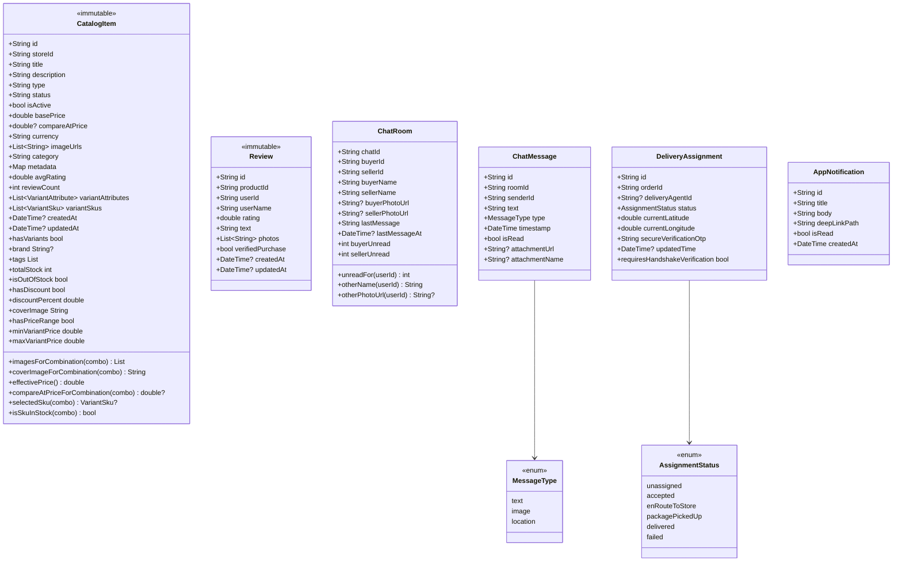

### Repository Interfaces (5)

#### `MarketplaceRepository`
| Method | Returns | Description |
|--------|---------|-------------|
| `fetchGlobalCatalog(lastDoc, limit)` | `Future<Either<String, List<CatalogItem>>>` | Paginated catalog |
| `fetchItemsByStore(storeId)` | `Future<Either<String, List<CatalogItem>>>` | Store products |
| `searchLocalServices(query)` | `Future<Either<String, List<CatalogItem>>>` | Service search |
| `fetchProductById(productId)` | `Future<Either<String, CatalogItem>>` | Single product |

#### `SearchRepository`
| Method | Returns | Description |
|--------|---------|-------------|
| `searchCatalog(query, filters)` | `Future<Either<String, List<CatalogItem>>>` | Full-text search |
| `getSearchSuggestions(prefix)` | `Future<List<String>>` | Autocomplete |
| `saveRecentSearch(userId, query)` | `Future<void>` | Save search |
| `getRecentSearches(userId)` | `Future<List<String>>` | Get recent |
| `clearRecentSearches(userId)` | `Future<void>` | Clear history |

#### `CommunicationRepository`
| Method | Returns | Description |
|--------|---------|-------------|
| `streamRoomMessages(roomId)` | `Stream<List<ChatMessage>>` | Live messages |
| `dispatchLiveMessage(roomId, msg)` | `Future<Either>` | Send message |
| `streamChatRooms(userId)` | `Stream<List<ChatRoom>>` | Live chat rooms |
| `createOrGetChatRoom(buyerId, sellerId, ...)` | `Future<Either<String, String>>` | Get/create room |
| `markRoomRead(roomId, userId)` | `Future<void>` | Mark as read |
| `setTyping(chatId, userId, isTyping)` | `Future<void>` | Typing indicator |
| `streamOtherTyping(chatId, userId)` | `Stream<bool>` | Watch typing |
| `registerDevicePushToken(userId, token)` | `Future<void>` | Register FCM |

#### `ReviewRepository`
| Method | Returns | Description |
|--------|---------|-------------|
| `getProductReviews(productId)` | `Future<Either<String, List<Review>>>` | Fetch reviews |
| `submitReview(review)` | `Future<Either<String, Unit>>` | Submit review |
| `deleteReview(reviewId)` | `Future<Either<String, Unit>>` | Delete review |

#### `LogisticsRepository`
| Method | Returns | Description |
|--------|---------|-------------|
| `streamActiveAssignment(orderId)` | `Stream<DeliveryAssignment?>` | Live tracking |
| `updateAgentCoordinates(id, lat, lng)` | `Future<Either>` | Update position |
| `advanceAssignmentStatus(id, status)` | `Future<Either>` | Advance status |

### Controllers

#### `MarketplaceController` (AsyncNotifier\<List\<CatalogItem\>\>)
| Method | Description |
|--------|-------------|
| `build()` | Fetches initial catalog |
| `loadNextCatalogPage()` | Pagination |

#### `SearchController` (AsyncNotifier\<List\<CatalogItem\>\>)
| Method | Description |
|--------|-------------|
| `search(query, filters)` | Execute search |
| `clearRecentSearches()` | Clear history |

#### `CommunicationController` (AsyncNotifier\<void\>)
| Method | Description |
|--------|-------------|
| `transmitText(roomId, msg)` | Send message |
| `createOrGetRoom(buyerId, sellerId, ...)` | Get/create chat room |
| `markRead(roomId)` | Mark room as read |
| `setTyping(chatId, isTyping)` | Set typing state |
| `associateDeviceToken(token)` | Register FCM |

#### `LogisticsController` (AsyncNotifier\<void\>)
| Method | Description |
|--------|-------------|
| `submitLiveCoordinates(id, lat, lng)` | Update agent position |
| `transitionWorkflowStage(id, status)` | Advance delivery status |

#### `NotificationController` (AsyncNotifier\<void\>)
| Method | Description |
|--------|-------------|
| `markAsRead(notificationId)` | Mark single as read |
| `markAllAsRead()` | Mark all as read |

### Additional Providers

| Provider | Type | Description |
|----------|------|-------------|
| `productDetailProvider(productId)` | `FutureProvider.family` | Single product fetch |
| `recentSearchesProvider` | Provider | Recent searches |
| `liveMessageStreamProvider(roomId)` | `StreamProvider.family` | Live messages |
| `chatRoomsStreamProvider(userId)` | `StreamProvider.family` | Chat rooms |
| `otherTypingStreamProvider(chatId, userId)` | `StreamProvider.family` | Typing indicator |
| `realTimeDispatchStreamProvider(orderId)` | `StreamProvider.family` | Delivery tracking |
| `userNotificationsProvider(userId)` | `StreamProvider.family` | User notifications |

### Screens & Widgets

| Screen | Description |
|--------|-------------|
| `ChatRoomsScreen` | List of chat conversations |
| `ChatScreen` | Chat conversation UI |
| `NotificationScreen` | Notification list |

| Widget | Description |
|--------|-------------|
| `ChatBubble` | Message bubble component |
| `ChatRoomCard` | Chat room list item |
| `ChatTypingIndicator` | "Typing..." indicator |

---

## 📦 Feature: Orders

### Entity Diagram

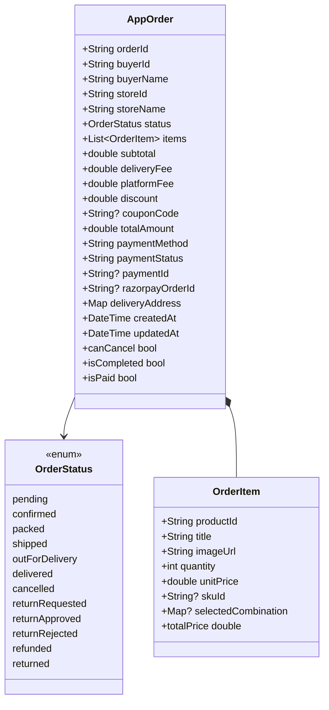

### Order Status Flow

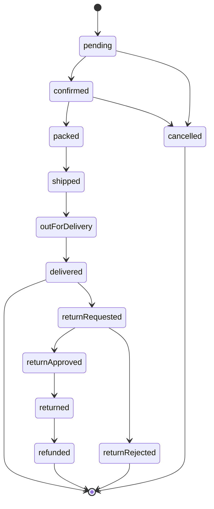

### Repository Interface

#### `OrderRepository`
| Method | Returns | Description |
|--------|---------|-------------|
| `checkout(order)` | `Future<Either<String, String>>` | Atomic checkout |
| `watchBuyerOrders(buyerId)` | `Stream<List<AppOrder>>` | Buyer's orders stream |
| `watchSellerOrders(storeId)` | `Stream<List<AppOrder>>` | Seller's orders stream |
| `updateOrderStatus(orderId, status)` | `Future<Either>` | Update status |
| `getOrderById(orderId)` | `Future<Either<String, AppOrder>>` | Single order |
| `cancelOrder(orderId)` | `Future<Either>` | Cancel order |

### Providers & Controllers

| Provider | Type | Description |
|----------|------|-------------|
| `orderRepositoryProvider` | Provider | OrderRepositoryImpl |
| `buyerOrdersProvider` | `StreamProvider` | `Stream<List<AppOrder>>` for buyer |
| `sellerOrdersProvider` | `StreamProvider` | `Stream<List<AppOrder>>` for seller (resolves storeId) |
| `orderByIdProvider(orderId)` | `FutureProvider.family` | Single order |

#### `OrderController` (AsyncNotifier\<void\>)
| Method | Returns | Description |
|--------|---------|-------------|
| `checkout(order)` | `Future<void>` | Process checkout |
| `updateStatus(orderId, status)` | `Future<void>` | Update order status |
| `cancelOrder(orderId)` | `Future<void>` | Cancel order |

---

## 🏪 Feature: Seller

### Entity Diagram

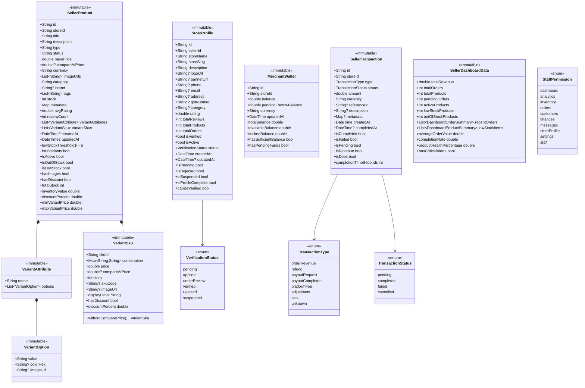

### Repository Interfaces (6)

#### `SellerRepository`
| Method | Returns | Description |
|--------|---------|-------------|
| `getStoreProfileBySeller(sellerId)` | `Future<Either<String, StoreProfile>>` | Get store profile |
| `updateStorefrontMetadata(storeId, data)` | `Future<Either>` | Update store |

#### `SellerProductRepository`
| Method | Returns | Description |
|--------|---------|-------------|
| `watchProducts(storeId)` | `Stream<List<SellerProduct>>` | Real-time products |
| `getProductById(productId)` | `Future<Either<String, SellerProduct>>` | Single product |
| `createProduct(product)` | `Future<Either<String, String>>` | Create → returns ID |
| `updateProduct(product)` | `Future<Either>` | Update product |
| `deleteProduct(productId)` | `Future<Either>` | Delete product |
| `updateStock(productId, stock)` | `Future<Either>` | Update stock |
| `updateStatus(productId, status)` | `Future<Either>` | Update status |
| `searchProducts(storeId, query)` | `Future<Either<String, List>>` | Search |
| `getProductsByCategory(storeId, category)` | `Future<Either<String, List>>` | Filter by category |

#### `SellerStoreRepository`
| Method | Returns | Description |
|--------|---------|-------------|
| `getStoreProfile(storeId)` | `Future<Either<String, StoreProfile>>` | Get profile |
| `updateStoreProfile(storeId, data)` | `Future<Either>` | Update profile |
| `updateStoreLogo(storeId, bytes)` | `Future<Either<String, String>>` | Upload logo |
| `updateStoreBanner(storeId, bytes)` | `Future<Either<String, String>>` | Upload banner |
| `updateStoreVerification(storeId, status)` | `Future<Either>` | Update verification |
| `getStoresByStatus(status)` | `Future<Either<String, List>>` | Filter by status |

#### `SellerDashboardRepository`
| Method | Returns | Description |
|--------|---------|-------------|
| `getDashboardData(storeId)` | `Future<Either<String, SellerDashboardData>>` | Full dashboard |
| `getDashboardMetrics(storeId)` | `Future<Either<String, Map>>` | Metrics only |

#### `SellerAnalyticsRepository`
| Method | Returns | Description |
|--------|---------|-------------|
| `getAnalytics(storeId)` | `Future<Either<String, SellerAnalytics>>` | Analytics |
| `getRevenueByDate(storeId, start, end)` | `Future<Either<String, List>>` | Revenue chart |
| `getProductAnalytics(storeId)` | `Future<Either<String, List>>` | Product perf |
| `getCustomerAnalytics(storeId)` | `Future<Either<String, List>>` | Customer data |

#### `SellerFinanceRepository`
| Method | Returns | Description |
|--------|---------|-------------|
| `getMerchantWallet(storeId)` | `Future<Either<String, MerchantWallet>>` | Wallet balance |
| `getTransactions(storeId)` | `Future<Either<String, List<SellerTransaction>>>` | Transaction list |
| `getTransactionsByType(storeId, type)` | `Future<Either<String, List>>` | Filter by type |
| `getTransactionsByDateRange(storeId, start, end)` | `Future<Either<String, List>>` | Filter by date |
| `requestPayout(storeId, amount)` | `Future<Either>` | Request payout |
| `updateBankAccount(storeId, data)` | `Future<Either>` | Update bank details |
| `getPayoutStatus(payoutId)` | `Future<Either<String, Map>>` | Check payout status |

### Controllers

#### `SellerController` (AsyncNotifier\<StoreProfile?\>)
| Method | Description |
|--------|-------------|
| `build()` | Loads store profile |
| `patchStoreSettings(data)` | Update store settings |
| `logout()` | Sign out |

#### `SellerDashboardController` (AsyncNotifier\<SellerDashboardData\>)
| Method | Description |
|--------|-------------|
| `build()` | Loads dashboard data |
| `refresh()` | Refresh dashboard |

#### `SellerInventoryController` (AsyncNotifier\<void\>)
| Method | Description |
|--------|-------------|
| `deleteProduct(productId)` | Delete product |
| `updateStock(productId, stock)` | Update stock |
| `updateStatus(productId, status)` | Update status |

#### `SellerFinancesController` (AsyncNotifier\<MerchantWallet\>)
| Method | Description |
|--------|-------------|
| `build()` | Loads wallet + triggers escrow release Cloud Function |
| `refresh()` | Refresh wallet |
| `requestPayout(amount)` | Request bank payout |
| `updateBankAccount(data)` | Update bank details |

### Screens (13)

| Screen | Size | Description |
|--------|------|-------------|
| `SellerDashboardScreen` | — | Dashboard overview |
| `AddProductScreen` | **77KB** | Product creation with variants |
| `EditProductScreen` | **83KB** | Product editing with variants |
| `SellerOrdersScreen` | — | Order management |
| `SellerInventoryScreen` | — | Inventory management |
| `SellerFinancesScreen` | **94KB** | Financial dashboard (largest screen) |
| `SellerAnalyticsScreen` | — | Analytics charts |
| `SellerCustomersScreen` | — | Customer management |
| `SellerSettingsScreen` | — | Store settings |
| `SellerStoreProfileScreen` | — | Store profile editor |
| `SellerStaffScreen` | — | Staff & permissions |
| `SellerReturnsScreen` | — | Returns management |
| `SellerApplicationScreen` | — | Re-exported from seller_application |

### Widgets (10)

| Widget | Description |
|--------|-------------|
| `SellerNavigation` | Navigation bar/rail |
| `SellerSidebar` | Desktop sidebar |
| `SellerProductCard` | Product card for seller |
| `SellerStatCard` | Statistics card |
| `SellerRevenueChart` | Revenue chart (fl_chart) |
| `SellerInventoryTable` | Inventory data table |
| `SellerStoreHeader` | Store header banner |
| `SellerEmptyState` | Empty state placeholder |
| `StaffDashboardView` | Staff member dashboard |
| `StoreVerificationStatusWidget` | Verification badge |

---

## 🛡️ Feature: Admin

### Entity Diagram

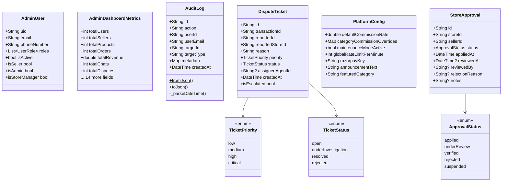

### Repository Interface — `AdminRepository` (largest interface, ~116 lines)

| Category | Method | Returns | Description |
|----------|--------|---------|-------------|
| **Dashboard** | `getDashboardMetrics()` | `Future<Either<String, AdminDashboardMetrics>>` | Full metrics |
| **Disputes** | `fetchAllDisputes()` | `Future<Either<String, List<DisputeTicket>>>` | All disputes |
| | `watchDisputes()` | `Stream<List<DisputeTicket>>` | Real-time disputes |
| | `updateDisputeStatus(id, status)` | `Future<Either>` | Update status |
| | `assignDispute(id, agentId)` | `Future<Either>` | Assign to agent |
| **Platform** | `fetchPlatformConfig()` | `Future<Either<String, PlatformConfig>>` | Get config |
| | `patchPlatformConfig(data)` | `Future<Either>` | Partial update |
| | `savePlatformConfig(config)` | `Future<Either>` | Full save |
| **Sellers** | `watchSellerApplications()` | `Stream<List<SellerApplication>>` | Applications stream |
| | `fetchSellerApplication(id)` | `Future<Either<String, SellerApplication>>` | Single app |
| | `approveSellerApplication(id)` | `Future<Either>` | Approve |
| | `rejectSellerApplication(id, reason)` | `Future<Either>` | Reject |
| | `requestChangesOnApplication(id, reason)` | `Future<Either>` | Request changes |
| **Stores** | `watchAllStores()` | `Stream<List<StoreProfile>>` | All stores stream |
| | `suspendStore(storeId)` | `Future<Either>` | Suspend |
| | `activateStore(storeId)` | `Future<Either>` | Activate |
| | `deleteStore(storeId)` | `Future<Either>` | Delete |
| **Users** | `watchAllUsers()` | `Stream<List<AdminUser>>` | All users stream |
| | `deleteUser(userId)` | `Future<Either>` | Delete user |
| | `updateUserRoles(userId, roles)` | `Future<Either>` | Update roles |
| | `setUserActiveStatus(userId, isActive)` | `Future<Either>` | Activate/deactivate |
| **Audit** | `watchAuditLogs()` | `Stream<List<AuditLog>>` | Audit log stream |
| | `createAuditLog(log)` | `Future<Either>` | Create log |
| **Orders** | `updateOrderStatus(orderId, status)` | `Future<Either>` | Update status |
| **Settlements** | `processSettlement(...)` | `Future<Either>` | Process settlement |
| | `rejectSettlement(id, reason)` | `Future<Either>` | Reject |
| | `completeSettlement(id)` | `Future<Either>` | Complete |
| **Refunds** | `processRefund(orderId, amount)` | `Future<Either>` | Process refund |

### Controllers

#### `AdminController` (AsyncNotifier\<void\>, keepAlive, **508 lines**)

| Method | Description |
|--------|-------------|
| `resolveTicket(ticketId, resolution)` | Resolve dispute |
| `assignTicket(ticketId, agentId)` | Assign dispute |
| `approveSellerApplication(applicationId)` | Approve seller |
| `rejectSellerApplication(applicationId, reason)` | Reject seller |
| `requestChangesOnSellerApplication(applicationId, reason)` | Request changes |
| `suspendStore(storeId)` | Suspend store |
| `activateStore(storeId)` | Activate store |
| `deleteStore(storeId)` | Delete store |
| `_auditActionHelper(action, targetId, targetType, metadata)` | Private — creates audit log for every action |

### Providers

| Provider | Type | Description |
|----------|------|-------------|
| `adminRepositoryProvider` | Provider | AdminRepositoryImpl |
| `adminDashboardMetricsProvider` | StreamProvider | Triggered by audit_logs changes |
| `pendingSellerApplicationsProvider` | StreamProvider | `Stream<List<SellerApplication>>` |
| `pendingEarlyReleaseRequestsCountProvider` | StreamProvider | `Stream<int>` from escrows |
| `adminAllStoresProvider` | StreamProvider | `Stream<List<StoreProfile>>` |
| `adminAllUsersProvider` | StreamProvider | `Stream<List<AdminUser>>` |
| `adminAllDisputesProvider` | StreamProvider | `Stream<List<DisputeTicket>>` |
| `adminAuditLogsProvider` | StreamProvider | `Stream<List<AuditLog>>` |
| `storeLiveStatsProvider(storeId)` | FutureProvider.family | Live store stats |

### Screens (17 — largest screen set)

| Screen | Size | Description |
|--------|------|-------------|
| `AdminAnalyticsScreen` | — | Platform analytics |
| `AdminAuditLogsScreen` | — | Audit log viewer |
| `AdminCategoryRequestsScreen` | — | Category requests |
| `AdminCouponsScreen` | — | Coupon management |
| `AdminEarlyReleasesScreen` | — | Escrow early releases |
| `AdminModerationScreen` | — | Content moderation |
| `AdminOrderDetailScreen` | — | Order detail view |
| `AdminOrdersScreen` | — | All orders |
| `AdminProductsScreen` | — | All products |
| `AdminReportsScreen` | — | Reports dashboard |
| `AdminSellersScreen` | — | Seller management |
| `AdminSettingsScreen` | — | Platform settings |
| `AdminSettlementsScreen` | **82KB** | Settlement processing |
| `AdminStoreApprovalsScreen` | — | Application review |
| `AdminStoreDetailScreen` | — | Store detail |
| `AdminStoresScreen` | — | All stores |
| `AdminUsersScreen` | — | User management |

---

## 📝 Feature: Seller Application

### Entity

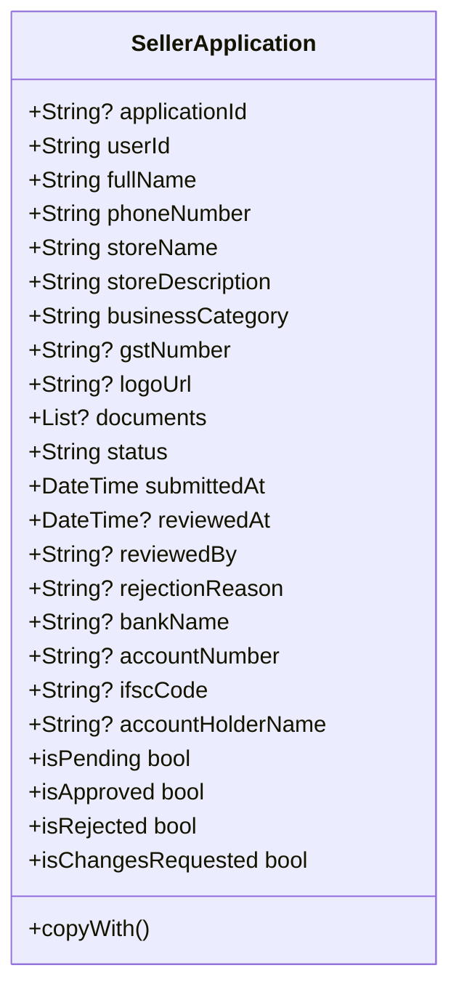

### Repository, Controller, Screen

| Component | Details |
|-----------|---------|
| **`SellerApplicationRepository`** (interface) | `submitApplication(app)` → `Future<Either<String, Unit>>` |
| **`SellerApplicationRepositoryImpl`** | Firestore implementation |
| **`SellerApplicationController`** (AsyncNotifier\<void\>) | `submit()` — validates user, creates application, submits |
| **`userSellerApplicationProvider`** | `FutureProvider<SellerApplication?>` — fetches current user's application |
| **`SellerApplicationScreen`** | **29KB** — Full application form with bank details, IFSC lookup |

---

## ☁️ Firebase Cloud Functions (12 Functions)

### Function Interaction Map

```mermaid
graph TD
    subgraph "HTTPS Callable Functions"
        GRK["getRazorpayKey<br/>(HTTP GET)"]
        CRO["createRazorpayOrder<br/>(HTTP POST)"]
        VFP["verifyAndFinalizePayment<br/>(HTTP POST)"]
        RME["releaseMaturedEscrows<br/>(HTTP POST)"]
        GIP["generateInvoicePDF<br/>(HTTP POST)"]
        CS["completeSettlement<br/>(HTTP POST)"]
    end

    subgraph "Firestore Triggers"
        OSU["onOrderStatusUpdate<br/>(orders/{orderId})"]
        APR["aggregateProductReviews<br/>(reviews/{reviewId})"]
        CLS["checkLowStock<br/>(catalog/{docId})"]
        USK["updateSearchKeywords<br/>(catalog/{docId})"]
    end

    subgraph "Scheduled Functions"
        SER["scheduledEscrowRelease<br/>(Every 1 hour)"]
        CAC["checkAbandonedCarts<br/>(Every 24 hours)"]
    end

    subgraph "Firestore Collections"
        CATALOG["catalog"]
        ORDERS["orders"]
        ESCROWS["escrows"]
        WALLETS["wallets"]
        TRANSACTIONS["transactions"]
        REVIEWS["reviews"]
        USERS["users"]
        STORES["stores"]
        COUPONS["coupons"]
        PAYOUTS["payouts"]
        SETTLEMENTS["settlements"]
    end

    VFP -->|"reads"| CATALOG & STORES & COUPONS
    VFP -->|"writes"| ORDERS & TRANSACTIONS & WALLETS & ESCROWS & USERS
    OSU -->|"reads/writes"| ESCROWS
    APR -->|"reads/writes"| CATALOG & STORES
    CLS -->|"reads"| CATALOG
    CLS -->|"writes"| USERS
    SER -->|"reads/writes"| ESCROWS & WALLETS & TRANSACTIONS & PAYOUTS
    CAC -->|"reads/writes"| USERS
    CS -->|"reads/writes"| PAYOUTS & SETTLEMENTS & WALLETS & TRANSACTIONS & USERS
    RME -->|"reads/writes"| ESCROWS & WALLETS & TRANSACTIONS & PAYOUTS
```

### Function Detail Table

| # | Function | Trigger | Auth | Description |
|---|----------|---------|------|-------------|
| 1 | `getRazorpayKey` | HTTP GET | ✅ | Returns Razorpay public key from secrets |
| 2 | `createRazorpayOrder` | HTTP POST | ✅ | Creates Razorpay order, validates amount ≥ 100 paise |
| 3 | `verifyAndFinalizePayment` | HTTP POST | ✅ | **CRITICAL** — HMAC-SHA256 verify, stock check (variants + simple), flash sale pricing, coupon validation, creates orders + transactions + escrows + wallet updates + notifications, clears cart |
| 4 | `releaseMaturedEscrows` | HTTP POST | ✅ | Releases matured/early escrows → credits wallet → optional RazorpayX bank payout |
| 5 | `generateInvoicePDF` | HTTP POST | ✅ | Generates PDF invoice for order using `pdfkit` |
| 6 | `completeSettlement` | HTTP POST | ✅ Admin | Completes payout settlement, triggers RazorpayX, decrements wallet |
| 7 | `onOrderStatusUpdate` | Firestore trigger | — | On `delivered`: extends escrow. On `cancelled/refunded/returned/failed`: cancels escrow |
| 8 | `aggregateProductReviews` | Firestore trigger | — | Recalculates `avgRating`/`reviewCount` on catalog + store |
| 9 | `checkLowStock` | Firestore trigger | — | Notifies seller when stock < 5 |
| 10 | `updateSearchKeywords` | Firestore trigger | — | Regenerates `searchKeywords` array |
| 11 | `scheduledEscrowRelease` | Every 1 hour | — | Auto-releases matured escrows + auto bank payouts |
| 12 | `checkAbandonedCarts` | Every 24 hours | — | Sends "left something behind" notifications |

### Helper Functions (not exported)

| Function | Description |
|----------|-------------|
| `verifyAuth(req, res)` | Verifies Firebase ID token from Authorization header |
| `performRazorpayPayout(storeId, amount, referenceId, db)` | Calls RazorpayX Payout API |
| `isFlashSaleActive(itemData)` | Checks flash sale time bounds |
| `getEffectivePrice(itemData, skuPrice)` | Returns flash-discounted or base price |

---

## 🗄️ Firestore Collection Map

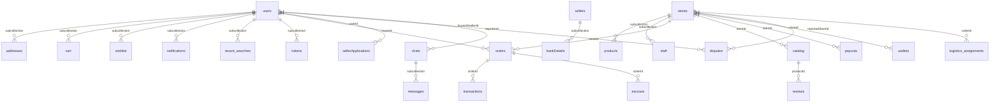

### Collection Access Matrix

| Collection | Path | Read | Create | Update | Delete |
|-----------|------|------|--------|--------|--------|
| **users** | `/users/{userId}` | Owner, admin, seller, storeManager | Self (roles=['buyer']) | Admin (full), owner (restricted), seller/storeManager (storeId+roles) | superAdmin |
| **stores** | `/stores/{storeId}` | Verified or owner/admin; list: admin | Admin | Owner/admin | superAdmin |
| **catalog** | `/catalog/{productId}` | Active or logged in; list: public | Logged in + storeId==uid | Admin/owner/stock-deduction | Owner |
| **orders** | `/orders/{orderId}` | Buyer/seller/admin (scoped) | Buyer (status='pending') | Admin (refunds), seller (shipping), buyer (cancel/return) | — |
| **sellerApplications** | `/sellerApplications/{appId}` | Self or admin | Self (status='pending') | Admin or self (restricted) | — |
| **payment_failures** | `/payment_failures/{id}` | Buyer or admin | Buyer | — | — |
| **transactions** | `/transactions/{id}` | Buyer/seller/admin (scoped) | Admin only | — | — |
| **wallets** | `/wallets/{sellerId}` | Owner or admin | — | Admin only (balance ≥ 0) | — |
| **payouts** | `/payouts/{id}` | Seller/admin (scoped) | Seller (status='pending', validated) | Admin (status fields) | — |
| **escrows** | `/escrows/{id}` | Seller or admin | — | Seller (release_requested only) | — |
| **reviews** | `/reviews/{id}` | Public | Logged in (validated) | Admin | Owner/admin |
| **chats** | `/chats/{roomId}` | Participants or admin | 2 participants | Participants (no identity changes) | — |
| **disputes** | `/disputes/{id}` | Reporter or admin | Reporter | Admin | — |
| **platform_settings** | `/platform_settings/{id}` | Public | — | Admin | — |
| **categories** | `/categories/{id}` | Public | — | Admin | Admin |
| **coupons** | `/coupons/{id}` | Public | Admin | Admin or logged-in (usageCount++) | Admin |
| **audit_logs** | `/audit_logs/{id}` | Admin | Any logged-in | — | — |
| **settlements** | `/settlements/{id}` | Admin or seller | — | Admin (status) | — |

### Firestore Security Rule Helper Functions

| Function | Description |
|----------|-------------|
| `isLoggedIn()` | `auth != null` |
| `getUserData()` | Reads `/users/{uid}` |
| `hasRole(role)` | Checks role in user's roles array |
| `isOwner(userId)` | `uid == userId` |
| `isAdmin()` | `hasRole('admin') \|\| hasRole('superAdmin')` |
| `isString(value, min, max)` | String type + length validation |
| `isNumber(value, min, max)` | Int/float + range validation |
| `isList(value, max)` | List type + size validation |
| `isStoreOwner(storeId)` | `uid == storeId` |
| `isStoreMember(storeId)` | `uid == storeId OR user.storeId == storeId` |

---

## 📊 Firestore Indexes (18 Composite)

| Collection | Fields | Order |
|-----------|--------|-------|
| catalog | `isActive` + `createdAt` | ASC + DESC |
| catalog | `isActive` + `basePrice` | ASC + ASC |
| catalog | `isActive` + `basePrice` | ASC + DESC |
| catalog | `isActive` + `category` + `createdAt` | ASC + ASC + DESC |
| catalog | `isActive` + `category` + `basePrice` | ASC + ASC + ASC |
| catalog | `isActive` + `category` + `basePrice` | ASC + ASC + DESC |
| catalog | `storeId` + `isActive` + `createdAt` | ASC + ASC + DESC |
| catalog | `isActive` + `avgRating` | ASC + DESC |
| products | `metadata.category` + `createdAt` | ASC + DESC |
| products | `status` + `createdAt` | ASC + DESC |
| payouts | `status` + `requestedAt` | ASC + DESC |
| payouts | `storeId` + `requestedAt` | ASC + DESC |
| orders | `buyerId` + `createdAt` | ASC + DESC |
| orders | `storeId` + `createdAt` | ASC + DESC |
| transactions | `buyerId` + `externalTransactionId` | ASC + ASC |
| transactions | `storeId` + `createdAt` | ASC + DESC |
| transactions | `storeId` + `type` + `createdAt` | ASC + ASC + DESC |
| escrows | `status` + `releaseAt` | ASC + ASC |
| sellerApplications | `status` + `submittedAt` | ASC + DESC |

---

## 💰 Payment & Escrow Flow

```mermaid
sequenceDiagram
    participant Buyer
    participant App as Flutter App
    participant RZP as Razorpay
    participant CF as Cloud Functions
    participant FS as Firestore

    Buyer->>App: Checkout
    App->>CF: createRazorpayOrder(amount)
    CF->>RZP: Create Order
    RZP-->>CF: Order ID
    CF-->>App: Order Details
    App->>RZP: Launch Payment (mobile/web)
    RZP-->>App: Success (paymentId, orderId, signature)
    App->>CF: verifyAndFinalizePayment(signature, orders)
    CF->>CF: HMAC-SHA256 Verify Signature
    CF->>FS: Validate stock + pricing
    CF->>FS: Create Orders
    CF->>FS: Create Transactions
    CF->>FS: Create Escrows (hold funds)
    CF->>FS: Update Wallets (pendingEscrowBalance)
    CF->>FS: Clear Cart
    CF->>FS: Send Notifications
    CF-->>App: {success: true, orderIds}

    Note over FS: Order lifecycle begins...
    FS->>CF: onOrderStatusUpdate (delivered)
    CF->>FS: Extend escrow releaseAt +7 days

    Note over CF: Hourly cron job
    CF->>FS: scheduledEscrowRelease
    CF->>FS: Release escrow → credit wallet
    CF->>RZP: Auto bank payout (if bank linked)
```

---

## 🏗️ Complete Project Statistics

| Metric | Count |
|--------|-------|
| **Feature Modules** | 7 |
| **Domain Entities** | 30+ |
| **Repository Interfaces** | 22 |
| **Repository Implementations** | 22 |
| **Riverpod Providers** | 50+ |
| **Controller/Notifier Classes** | 20+ |
| **Screens/Pages** | 65+ |
| **Custom Widgets** | 60+ |
| **Cloud Functions** | 12 |
| **Firestore Collections** | 25+ |
| **Firestore Security Rules** | 530 lines |
| **Firestore Indexes** | 18 composite |
| **DTOs with Codegen** | 15+ |
| **Enums** | 20+ |
| **External Integrations** | 4 (Razorpay, RazorpayX, Cloudinary, IFSC API) |

---

> [!TIP]
> Use `Ctrl+F` to search for any specific class, method, provider, or collection name. Every function in the project is documented above.
